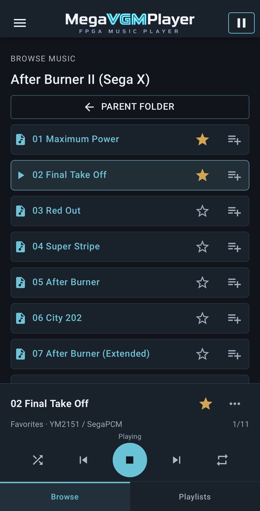
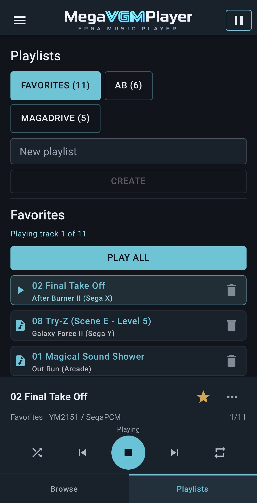

# MegaVGMDrive / MegaVGMPlayer

**MegaVGMPlayer**は、MiSTer向けのFPGA VGM音楽プレイヤーです。**MegaVGMDrive**は、その基盤となるrepository／FPGA core開発projectの名称です。

[English](README.md) · [MegaVGMPlayer v2.0をダウンロード](https://github.com/dai-VGM/MegaVGMDrive/releases/tag/v2.0)

> **開発について:** このプロジェクトの実装とデバッグのほぼすべてはOpenAI CodexとGPTが行いました。私は実際の音を聴き、Quartusでbuildし、MiSTer実機のデバッグ値や聴感結果をCodexへ返す役割を担当しました。

## MegaVGMPlayer v2.0 Remote / PWA

<p align="center">
  
  
</p>

<p align="center"><em>iPhoneのホーム画面へ追加したPWAのBrowse／Playlists画面。</em></p>

## v2.0の主な機能

- iPhone／iPad／desktop browser向けRemote / PWA Player
- folder Browse、Playlist、Favorites
- Previous、Next、即時Stop
- Repeat One、Repeat Context、Shuffle
- automatic nextと曲間transition fade
- YM2610／YM2610B対応
- VGMに必要なFPGA sound engine／RBFの自動選択・切替
- 異なるsound engineの曲を含むmixed-engine playlist
- Playlist完了またはExit後のstock MiSTer自動復帰

通常の再生では、ユーザーがRBFや内部engineを選ぶ必要はありません。MegaVGMPlayerが曲を分類し、必要なFPGA sound engineを自動的に選択します。

## 対応音源

v2.0の再生経路は、次の音源を対象としています。

- YM2612
- YM2151
- YM2203
- SegaPCM
- YM2610
- YM2610B
- 各経路で必要となるPSG／SSG、ADPCM-A／ADPCM-B

Remote Playerに表示されるsound-chip名は補助情報です。元VGMやpackage metadataが十分でない場合、表示が完全でないことがあります。

## インストール

1. [MegaVGMPlayer v2.0 Release](https://github.com/dai-VGM/MegaVGMDrive/releases/tag/v2.0)から`MegaVGMPlayer_v2.0.zip`をdownloadして展開します。
2. ZIP内の`media/fat/`以下を、directory構造を保ったままMiSTerの`/media/fat/`へcopyします。
3. MiSTerをrebootします。
4. 同じLAN上のbrowserで次を開きます。

```text
http://<MiSTer-IP>:8182/megavgm
```

既に`/media/fat/Scripts/remote.sh`を使用している場合は、手動copy前にbackupしてください。

Advanced user向けには、packageにchecksum確認とtimestamp付きbackupを行う`install.sh`、およびbackupから復元する`rollback.sh`も含まれています。MegaVGMPlayerをSTOCKへ戻してから実行してください。

FPGA sound-engine fileの正式配置先:

```text
/media/fat/_Custom Cores/Cores/
```

主なruntime layout:

```text
/media/fat/_Custom Cores/Cores/
  MegaVGMPlayer_Transport13FadeOnly_A_MiSTer.rbf
  MegaVGMPlayer_Transport13FadeOnly_B_MiSTer.rbf

/media/fat/MegaVGMPlayer/
  MiSTer.megavgm
  megavgm_supervisor
  megavgm_playlist-phase2a

/media/fat/Scripts/
  remote.sh
  vgm_md_import.sh
```

これらのA/B名は内部実装上のprofileです。通常操作で意識する必要はありません。

## VGM音楽の追加

v2.0では、既存libraryとの互換性を優先して次を標準rootとします。

```text
/media/fat/MegaVGMDrive/
```

`.vgm`、`.vgz`、またはVGM/VGZを含む`.zip`を次へcopyします。

```text
/media/fat/MegaVGMDrive/inbox/
```

その後、MiSTerで次を実行します。

```sh
/media/fat/Scripts/vgm_md_import.sh
```

準備されたVGMは次へ保存されます。

```text
/media/fat/MegaVGMDrive/vgm_cache/
```

Importerは必要に応じて圧縮fileを展開し、表示titleやsound-chip補助metadataを生成します。FPGAがZIPを直接再生する機能ではありません。

## Remote Player

MiSTerと同じLAN上のbrowserから次へ接続します。

```text
http://<MiSTer-IP>:8182/megavgm
```

固定IPは必須ではありません。MiSTerのIPが変わる場合は、router側でDHCP reservationを設定すると便利です。

iPhone／iPadではSafariでページを開き、「ホーム画面に追加」するとstandalone PWAとして利用できます。

## Playlist、Favorites、Repeat、Shuffle

- **Favorites:** starを付けた曲をまとめたbuilt-in playlistです。
- **Repeat One:** 現在の1曲を繰り返します。
- **Repeat Context:** 現在のfolder、Playlist、またはFavorites snapshot全体を繰り返します。
- **Shuffle:** 現在の再生context内で曲順をshuffleします。
- **Stop:** 現在の再生を即時停止します。

Playlistから開始した再生queueはsnapshotとして所有され、Browse中のfolder表示とは独立して維持されます。

## FPGA sound engineの自動切替

Host側classifierが各VGMに必要なsound engineを判定します。次曲が別engineを必要とする場合、MegaVGMPlayerは現在曲をfadeし、Playlistの選択位置を維持したままRBFを切り替え、新しいsessionで次曲を開始します。

同じprofile内の曲切替ではRBFをreloadしません。異なるengineを含むPlaylistでも、ユーザー操作なしで連続再生できます。

## Cold startについて

Cold startでは、MegaVGMPlayerがFPGA sound engineを初期化するまで数秒かかることがあります。一度起動した後の通常の曲切替とは異なる初期化処理です。

## Troubleshooting

- Remote Playerが開かない場合は、`http://<MiSTer-IP>:8182/megavgm`を同じLANから開いているか確認してください。
- TCP 8182を複数のRemote processが同時に使用していないか確認してください。
- package内の`SHA256SUMS`でinstalled fileを検証してください。
- Main、Supervisor、controller、Remote、両RBFは同一release setとして使用してください。
- updateに失敗した場合はSTOCKへ戻し、installerが作成したbackupを指定して`rollback.sh`を実行してください。

## MegaVGMDriveとの関係

MegaVGMDriveはFPGA/core開発repositoryです。MegaVGMPlayerは、FPGA sound engine、modified MiSTer Main、Supervisor、Playlist controller、Remote/PWA、Importerを統合したユーザー向け製品です。

VGM register streamはsoftware synthesizerではなく、synthesizable FPGA sound-core HDLへ送られます。

```text
VGM data
  -> FPGA VGM parser
  -> FPGA sound-core HDL
  -> FPGA mixer
  -> MiSTer audio output
```

FPGA実装が自動的にoriginal siliconやsoftware emulatorより正確または高音質になる、という意味ではありません。JT coreはhardware implementationであり、transistor-level identityを主張するものではありません。

## Contributor向け: 新しいsound engineの追加

新profileは既存のgeneric transport ABIへ適応してください。主なcontractは、index-1 load lifecycle、index-2 policy／transition分離、session／busy／done／loop status、common fade owner、FADE_ONLYからENDEDへの遷移、安全なnew-session audio qualificationです。

Queue ownershipやMainから見えるstatus semanticsを変更せずにhost classifier／profile mappingを拡張し、simulation、Windows Quartus Full Compilation、MiSTer実機の順で検証します。Golden Player Shellの保護規則とstage-gated workflowは[AGENTS.md](AGENTS.md)を参照してください。

## 既知事項

- MegaVGMPlayerはstandalone VGM音楽playerであり、console／arcade machine本体の完全実装ではありません。
- 実装範囲外のcommand／deviceを含むVGMは、意図どおり再生されない場合があります。
- FPGAは`.vgz`／`.zip`をnative展開しません。付属Importerを使用してください。
- Mega CD / RF5C164および32X PWMはv2.0の対象外です。

## 謝辞とupstream project

MegaVGMDriveは[MiSTer FPGA platform](https://github.com/MiSTer-devel/Main_MiSTer)向けに開発しています。次のprojectを利用、またはintegrationの基礎としています。

- [Genesis_MiSTer](https://github.com/MiSTer-devel/Genesis_MiSTer)
- José Tejada Gómez（Jotego）によるJT12、JT89、JT49、JT51、JT10および関連JT core
- JotegoのJTOUTRUN / `jtoutrun_pcm`実装によるSegaPCM

固定したrevisionとlocal integrationについては[Genesis audio provenance](rtl/genesis_audio/README.md)を参照してください。元のcopyright noticeとsource headerは保持しています。

## License

Third-party componentには各upstream licenseが適用されます。同梱の[JT51 license](third_party/jt51/LICENSE)、[JT cores license](third_party/jtcores/LICENSE)、各component README、個別source headerを確認してください。

このrepositoryには独立したtop-level `LICENSE` fileがありません。すべてのfileへ単一licenseが適用されると推測せず、再配布前に対象componentのlicenseとsource noticeを確認してください。
